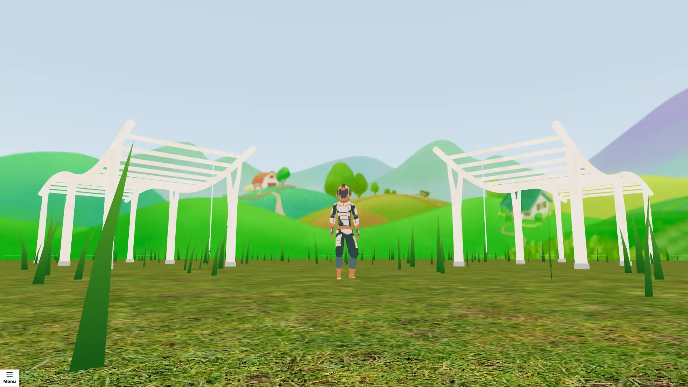

# Stop the Thieves



Stop the thieves from taking all your barrels. Shoot the thieves as they move towards the center. If they get too close they will grab a barrel and start walking away with it.

## Getting Started

First you will need to setup a .env file from the .env.sample provided.

Then development server can be run:

```bash
npm run dev
```

## Multiplayer

Websocket backend code is not in this repo or available at this time.

## Scripts

In the scripts folder is reset_public and sync_to_s3. This is only for Articles Media usage. Allows for putting public folder to CloudFront to lower Vercel charges for the public facing site.